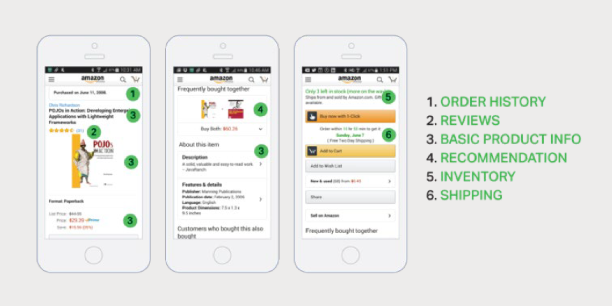
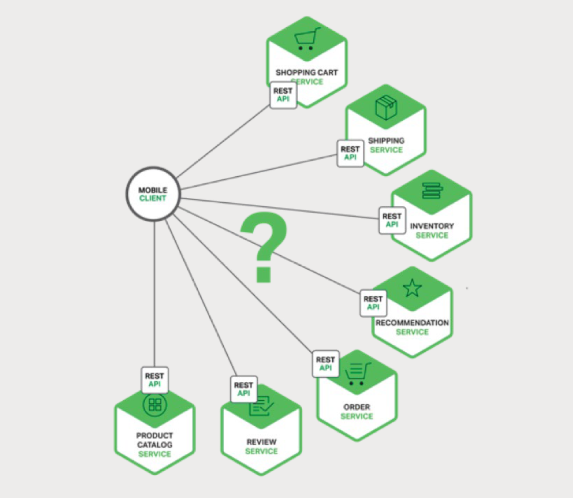
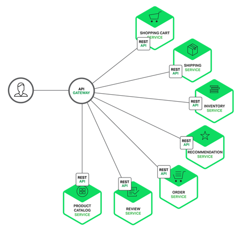

# 2、使用 API 网关
本书的七个章节是关于如何设计、构建和部署微服务。[第一章](1-introduction-to-microservices.md)介绍了微服务架构模式。它阐述了使用微服务的优点与缺点，以及尽管如此，微服务通常是复杂应用的理想选择。该系列的第二章将探讨使用 API 网关构建微服务。

当您选择将应用程序构建成为一组微服务时，您需要决定应用程序客户端将如何与微服务进行交互。单体应用程序只有一组端点（endpoint），通常使用复制（replicated）结合负载均衡来分配流量。

然而，在微服务架构中，每个微服务都暴露一组通常比较细颗粒的端点。在本文中，我们将研究如何改进客户端通信，并提出一个使用 API 网关的方案。

<a id="introduction"></a>

## 2.1、简介
我们假设您正在为一个购物应用开发一个原生移动客户端。您可能需要实现一个产品详细信息页面，用于展示给定商品的信息。

例如，图 2-1 展示了在 Amazon 的 Android 移动应用中滚动产品信息时所看到的内容。



这是一个智能手机应用，产品详细信息页面展示了许多信息。不仅有基本的产品信息，如名称、描述和价格，页面还展示了：

1. 购物车中的物品数量
2. 订单历史
3. 客户评价
4. 低库存警告
5. 配送选项
6. 各种推荐，包括了购买此产品的客户购买的其他产品
7. 选择性购买选项

在使用单体应用架构的情况下，移动客户端通过对应用程序进行单个 REST 调用来检索此数据，例如：

```
GET api.company.com/productdetails/productId
```

负载均衡器将请求路由到几个相同应用程序实例中的其中一个。之后，应用程序查询各个数据库表并返回响应给客户端。相比之下，当使用微服务架构时，产品详细页面上展示的数据来自多个微服务。以下是一些微服务，可能拥有给定产品页面展示的数据：

- **订单服务** — 订单历史
- **目录（catalog）服务** — 基本的产品信息，如产品名称、图片和价格
- **评价服务** — 客户评价
- **库存服务** — 低库存警告
- **配送服务** — 配送选项、期限和费用，由配送方的 API 单独提供  
- **推荐服务** — 推荐类目



我们需要决定移动客户端如何访问这些服务。让我们来看看有哪些方法。

<a id="direct-client-to-microservice-communication"></a>

## 2.2、客户端与微服务直接通信
理论上，客户端可以直接向每个微服务发送请求。每个微服务都有一个公开的端点：

```
https://serviceName.api.company.name
```
该 URL 将映射到用于跨可用实例分发请求的微服务负载均衡器。为了检索特定的产品页面信息，移动客户端将向上述的每个微服务发送请求。

不幸的是，这种方式存在着挑战与限制。第一个问题是客户端的需求与每个微服务暴露的细粒度的 API 不匹配。在此示例中，客户端需要进行七次单独请求。如果在更加复杂的应用中，它可能需要做更多的工作。例如，Amazon 展示了在产品页面渲染中如何牵涉到数百个微服务。虽然客户端可以通过 LAN 发送许多请求，但在公共互联网下效率低下，在移动网络必然是不切实际。

客户端直接调用微服务存在的另一个问题是有些可能使用了非 web 友好协议。一个服务可能使用了 Thrift 二进制 RPC，而另一个则可能使用 AMQP 消息协议。这两个协议无论是对浏览器还是防火墙都是不友好的，最好是在内部使用。应用程序在防火墙之外应该使用 HTTP 或者 WebSocket 之类的协议。

这种方法的另一个缺点是它难以重构微服务。随着时间推移，我们可能会想改变系统划分服务。例如，我们可能会合并两个服务或者将服务拆分为两个或者多个。然而，如果客户端直接与服务进行通信，实施这类的重构将变得非常困难。

由于存在这些问题，很少有客户端直接与微服务进行通信。

<a id="using-an-api-gateway"></a>

## 2.3、使用 API 网关
通常更好的方法是使用 API 网关。API 网关是一个服务器，是系统的单入口点。它类似于面向对象设计模式中的门面（Facade）模式。API 网关封装了内部系统架构，并针对每个客户端提供一个定制 API。它还可用于认证、监控、负载均衡、缓存和静态响应处理。

图 2-3 展示了 API 通常如何整合架构



API 网关负责请求路由、组合和协议转换。所有的客户端请求首先要通过 API 网关，之后请求被路由到适当的服务。API 网关通常会通过调用多个微服务和聚合结果来处理一个请求。它可以在 Web 协议（如 HTTP 和 WebSocket）和用于内部的非 Web 友好协议之间进行转换。

API 网关还可以为每个客户端提供一个定制 API。它通常会为移动客户端暴露一个粗粒度的 API。例如，考虑一下产品详细信息场景。API 网关可以提供一个端点 `/productdetails?productid=xxx`，如图 2-3 所示，一个使用了 API 网关的微服务。允许移动客户端通过一个单独的请求来检索所有产品详细信息。API 网关通过调用各种服务（产品信息、推荐、评价等）并组合结果。

一个很好的 API 网关案例是 [Netflix API 网关](http://techblog.netflix.com/2013/02/rxjava-netflix-api.html)。Netflix 流媒体服务可用于数百种不同类型的设备，包括电视机、机顶盒、智能手机、游戏机和平板电脑等。起初，Netflix 尝试为他们的流媒体服务提供一个[通用](http://www.programmableweb.com/news/why-rest-keeps-me-night/2012/05/15)的 API。后来，他们发现由于设备种类繁多，并且他们各自有着不同需求，所以并不是能很好地运作。如今，他们使用了 API 网关，通过运行特定设备适配代码来为每个设备提供一个定制 API。

<a id="benefits-and-drawbacks-of-an-api-gateway"></a>

## 2.4、API 网关的优点与缺点
正如您所料，使用 API 网关同样存在好处与坏处。使用 API 网关的主要好处是它封装了应用程序的内部结构。客户端只需要与网关通信，而不必调用特定的服务。API 网关为每种类型的客户端提供了特定的 API，减少了客户端与应用程序之间的往返次数。同时，它还简化了客户端的代码。

API 网关也存在一些缺点，它是另一个高度可用的组件，需要开发、部署和管理。另外，还有一个风险是 API 网关可能会成为开发瓶颈。开发人员必须更新 API 网关以暴露每个微服务的端点。

重要的是更新 API 网关的过程应尽可能地放缓一些。否则，开发人员将被迫排队等待网关更新。尽管 API 网关存在这些缺点，但对于大多数的真实应用来说，使用 API 是合理的。

<a id="implementing-an-api-gateway"></a>

## 2.5、实现 API 网关
我们已经了解了使用 API 网关的动机和利弊，接下来让我们看看您需要考虑的各种设计问题。

<a id="performance-and-scalability"></a>

### 2.5.1、性能与可扩展性
只有少数公司能达到 Netflix 的运营规模，每天需要处理数十亿的请求。不管怎样，对于大多数应用来说，API 网关的性能和可扩展性是相当重要的。因此，在一个支持异步、非阻塞 I/O 平台上构建 API 网关是很有必要的。实现一个可扩展的 API 网关的技术多种多样。在 JVM 上，您可以使用基于 NIO 的框架，如 Netty、Vertx、Spring Reactor 或者 JBoss Undertow。一个流行的非 JVM 选择是使用 Node.js，它是一个建立在 Chrome 的 JavaScript 引擎之上的平台。此外，您还可以选择使用 NGINX Plus。

[NGINX Plus](https://www.nginx.com/solutions/api-gateway/) 提供了一个成熟、可扩展和高性能的 Web 服务器和反向代理，它易于部署、配置和编程。NGINX Plus 可以管理身份验证、访问控制、负载均衡请求、缓存响应，并且提供了应用程序健康检查和监控功能。

<a id="using-a-reactive-programming-model"></a>

### 2.5.2、使用响应式编程模型
API 网关处理大部分请求只是简单的把它们路由到与之对应的后端服务。它通过调用多个后端服务并聚合结果来处理其他请求。对于某些请求，如产品详细信息请求，对后端服务请求而言是彼此独立的。为了把响应时间缩短到最小，API 网关应该并发执行独立请求。

然而，有时候，请求是相互依赖的。首先，API 网关可能需要在将请求路由到后端服务之前，通过调用验证服务来验证该请求。同样，为了从客户的愿望清单中获取产品信息，API 网关首先必须检索包含该信息的客户资料，然后检索每个产品的信息。另一个有趣的 API 组合案例是 [Netflix 视频网格](http://techblog.netflix.com/2013/02/rxjava-netflix-api.html)。

使用传统的异步回调方式来编写 API 组合代码会很快使你陷入回调地狱。代码将会变得杂乱、难以理解并且容易出错。一个更好的方式是使用响应式方法以声明式编写 API 网关代码。响应式抽象的例子包括 Scala 的 [Future](http://docs.scala-lang.org/overviews/core/futures.html)、Java 8 中的 [CompletableFuture](https://docs.oracle.com/javase/8/docs/api/java/util/concurrent/CompletableFuture.html) 和 JavaScript 中的 [Promise](https://developer.mozilla.org/en-US/docs/Web/JavaScript/Reference/Global_Objects/Promise)。还有 [Reactive Extensions](http://reactivex.io/)（也称为 Rx 或 ReactiveX），最初由 Microsoft 为 .NET 平台开发。Netflix 为 JVM 创建了 RxJava，专门应用于其 API 网关。还有用于 JavaScript 的 RxJS，它可以在浏览器和 Node.js 中运行。使用响应式方式可让您能够编写出简单而高效的 API 网关代码。

<a id="service-invocation"></a>

### 2.5.3、服务调用
一个基于微服务的应用程序是一个分布式系统，必须使用一个进程间（inter-process）通信机制。有两种进程间通信方案。一是使用基于消息的异步机制。某些实现采用了消息代理，如 JMS 和 AMQP。其他采用无代理的方式直接与服务通信，如 Zeromq。

另一种类型的进程间通信采用了同步机制，如 HTTP 和 Thrift。系统通常会同时使用异步和同步方式。甚至可以为每种方式应用多个实现。因此，API 网关需要支持各种通信机制。

<a id="service-discovery"></a>

### 2.5.4、服务发现
API 网关需要知道与其通信的每个微服务的位置（IP 地址和端口）。在传统应用程序中，您可以将这些位置硬编码，但在现代基于云的微服务应用程序中，找到所需的位置不是一件简单的事情。

基础设施服务（比如消息代理）通常都有一个可以通过系统环境变量来指定的静态位置。但是，要确定应用程序服务的位置并不是那么容易。

应用服务可以动态分配位置。此外，由于自动扩缩和升级，一个服务的整组实例可以动态变更。因此，API 网关与系统中的任何其他服务客户端一样，需要使用系统的服务发现机制：[服务端发现](http://microservices.io/patterns/server-side-discovery.html)或[客户端发现](http://microservices.io/patterns/client-side-discovery.html)。[第四章](4-service-discovery.md)中更详细地描述了服务发现。现在需要注意的是，如果系统使用客户端发现，API 网关必须能够查询[服务注册中心](http://microservices.io/patterns/service-registry.html)，该注册中心是所有微服务实例及其位置的数据库。

<a id="handling-partial-failures"></a>

### 2.5.5、处理局部故障
实现 API 网关时必须解决的另一个问题是局部故障问题。当一个服务调用另一个响应缓慢或者不可用的服务时，所有分布式系统都会出现此问题。API 网关不应该无期限地等待下游服务。但是，如何处理故障问题取决于特定的方案和哪些服务发生故障。例如，如果推荐服务在获取产品详细信息时没有响应，API 网关应将其余的产品详细信息返回给客户端，因为它们对用户仍然有用。建议可以是空的，也可以用其他代替，例如硬编码的十强名单。然而，如果产品信息服务没有响应，那么 API 网关应该向客户端返回错误。

如果可以，API 网关还可以返回缓存数据。例如，由于产品价格变化不大，当价格服务不可用时，API 网关可以返回被缓存的价格数据。数据可以由 API 网关缓存或存储在外部缓存中，如 Redis 或 Memcached。API 网关通过返回默认数据或缓存数据，确保系统发生故障时最小程度上影响到用户体验。

[Netflix Hystrix](https://github.com/Netflix/Hystrix) 是一个非常有用的库，用于编写调用远程服务代码。Hystrix 可以使超出指定阈值的调用超时。它实现了断路器模式，防止客户端不必要地等待无响应的服务。如果服务的错误率超过指定阈值，Hystrix 将会跳闸，所有请求将在指定的时间内立即失败。Hystrix 允许您在请求失败时定义回退操作，例如从缓存读取或返回默认值。如果您正在使用 JVM，那么您一定要考虑使用 Hystrix。如果您是在非 JVM 环境中运行，则应使用同等作用的库。

<a id="summary"></a>

## 2.6、总结
对于大多数基于微服务的应用程序来说，实现一个 API 网关是很有意义的，API 网关充当着系统的单入口点，并且负责请求路由，组合和协议转换。它为每个应用程序客户端提供了一个自定义 API。API 网关还可以通过返回缓存或默认数据来掩盖后端服务故障。在下一章中，我们将介绍服务间的通信。

<a id="microservices-in-action"></a>

## 微服务实战：NGINX Plus 作为 API 网关

by Floyd Smith

本章讨论了如何将 API 网关作为系统的单入口点。它可以处理诸如负载均衡、缓存、监控和协议转换等其他功能 — 当 NGINX 充当反向代理服务器时，其可以作为系统的单入口点，并且支持所有提到的一个 API 网关具有的附加功能。因此使用 NGINX 作为 API 网关的主机可以很好地工作。

将 NGINX 作为 API 网关并不是本书最开始的想法。[NGINX Plus](https://www.nginx.com/products/) 是一个用于管理和保护基于 HTTP 的 API 流量的领先平台。您可以实现自己的 API 网关或使用现有的 API 管理平台，其中许多使用了 NGINX。

使用 NGINX Plus 作为 [API 网关](https://www.nginx.com/solutions/api-gateway/)的理由包括：

- **访问管理**

    上至典型的 Web 应用级别，下至每个个体微服务级别，您都可以使用各种访问控制列表（ACL）方法，并且可以轻松实现 SSL/TLS。
- **可管理性与弹性**

    您可以使用 NGINX 的动态重新配置 API、Lua 模块、Perl 来更新基于 NGINX Plus 的 API 服务器，也可以通过 Chef、Puppet、ZooKeeper 或 DNS 来改变。
- **与第三方工具集成**

    NGINX Plus 已经可以与某些先进的工具集成在一起，如 [3scale](https://www.nginx.com/blog/manage-api-gateway-less-3scale-nginx-plus/)，[Kong](https://www.nginx.com/blog/nginx-powers-kong-api-management-solution/) 和 [MuleSoft](https://www.nginx.com/blog/mulesoft-implements-nginx-plus/) 集成平台（仅列举在 NGINX 网站上提及的工具）。

NGINX Plus 被广泛用作 [NGINX 微服务参考架构](https://www.nginx.com/blog/introducing-the-nginx-microservices-reference-architecture/)中的 API 网关。您可以利用在这里收集的文章以及 MRA（微服务参考架构）来了解如何在您自己的应用程序中实现这一点。
