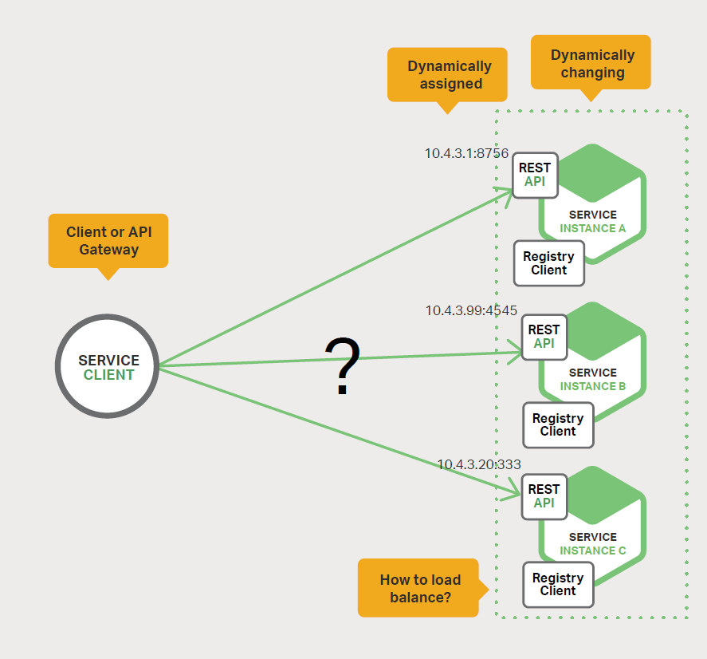
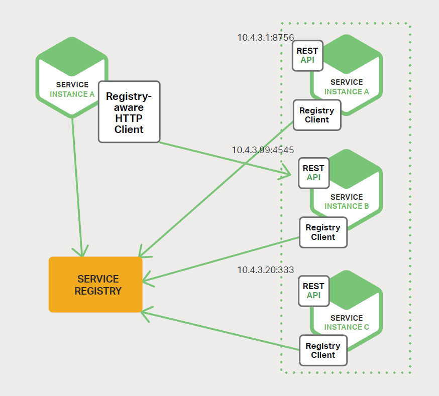
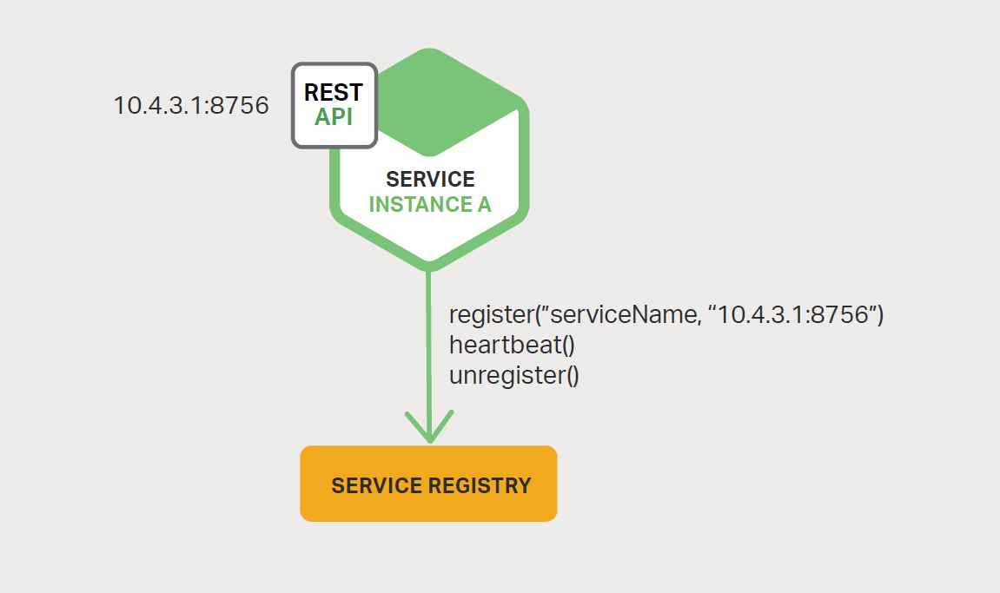

# 4、服务发现
本书主要介绍如何使用微服务来构建应用程序，现在是第四章。[第一章](1-introduction-to-microservices.md)已经介绍了[微服务架构模式](http://microservices.io/patterns/microservices.html)，并讨论了使用微服务的优点与缺点。[第二章](2-using-an-api-gateway.md)和[第三章](3-inter-process-communication.md)介绍了微服务间的通信，并对不同的通信机制作出对比。在本章中，我们将探讨服务发现（service discovery）相关的内容。

## 4.1、为何使用服务发现
我们假设您正在编写某些代码，这些代码调用了有 REST API 或 Thrift API 的服务。为了发送一个请求，您的代码需要知道服务实例的网络位置（IP 地址与端口）。在运行于物理硬件上的传统应用中，服务实例的网络位置是相对静态的。例如，您的代码可以从偶尔更新的配置文件中读取网络位置。

然而，在现代基于云的微服务应用中，这是一个更难解决的问题，如图 4-1 所示。

服务实例具有动态分配的网络位置。此外，由于自动扩缩、故障与升级，整组服务实例会动态变更。因此，您的客户端代码需要使用更精确的服务发现机制。

有两种主要的服务发现模式：客户端发现（client-side discovery）与服务端发现（server-side discovery）。让我们先来看看客户端发现。

## 4.2、客户端发现模式
当使用[客户端发现模式](http://microservices.io/patterns/client-side-discovery.html)时，客户端负责确定可用服务实例的网络位置和请求负载均衡。客户端查询服务注册中心（service registry），它是可用服务实例的数据库。之后，客户端利用负载均衡算法选择一个可用的服务实例并发出请求。

图 4-2 展示了该模式的结构

服务实例的网络位置在服务注册中心启动时被注册。当实例终止时，它将从服务注册中心中移除。通常使用心跳机制周期性地刷新服务实例的注册信息。

[Netflix OSS](https://netflix.github.io/) 提供了一个很好的客户端发现模式示例。[Netflix Eureka](https://github.com/Netflix/eureka) 是一个服务注册中心，它提供了一组用于管理服务实例注册和查询可用实例的 REST API。[Netflix Ribbon](https://github.com/Netflix/ribbon) 是一个 IPC 客户端，可与 Eureka 一起使用，用于在可用服务实例之间使请求负载均衡。本章稍后将讨论 Eureka。

客户端发现模式存在各种优点与缺点。该模式相对比较简单，除了服务注册中心，没有其他移动部件。此外，由于客户端能发现可用的服务实例，因此可以实现智能的、特定于应用程序的负载均衡决策，比如使用一致性哈希。该模式的一个重要缺点是它将客户端与服务注册中心耦合在一起。您必须为您使用的每种编程语言和框架实现客户端服务发现逻辑。

现在我们已经了解了客户端发现，接下来让我们看看服务端发现。

## 4.3、服务端发现模式
服务发现的另一种方式是服务端发现模式。图 4-3 展示了该模式的结构：

客户端通过负载均衡器向服务发出请求。负载均衡器查询服务注册中心并将每个请求路由到可用的服务实例。与客户端发现一样，服务实例由服务注册中心注册与销毁。

[AWS Elastic Load Balancer](https://aws.amazon.com/cn/elasticloadbalancing/)（ELB）是一个服务端发现路由示例。ELB 通常用于负载均衡来自互联网的外部流量。然而，您还可以使用 ELB 来负载均衡虚拟私有云（VPC）内部的流量。客户端通过 ELB 使用其 DNS 名称来发送请求（HTTP 或 TCP）。ELB 负载均衡一组已注册的 Elastic Compute Cloud（EC2）实例或 EC2 Container Service（ECS）容器之间的流量。这里没有单独可见的服务注册中心。相反，EC2 实例与 ECS 容器由 ELB 本身注册。

HTTP 服务器和负载均衡器（如 [NGINX Plus](https://www.nginx.com/products/) 和 NGINX）也可以作为服务端发现负载均衡器。例如，[此博文](https://www.airpair.com/scalable-architecture-with-docker-consul-and-nginx)描述了使用 [Consul Template](https://www.hashicorp.com/blog/introducing-consul-template.html) 动态重新配置 NGINX 反向代理。Consul Template 是一个工具，可以从存储在 [Consul 服务注册中心](https://www.consul.io/)中的配置数据中定期重新生成任意配置文件。每当文件被更改时，它都会运行任意的 shell 命令。在列举的博文描述的示例中，Consul Template 会生成一个 nginx.conf 文件，该文件配置了反向代理，然后通过运行一个命令告知 NGINX 重新加载配置。更复杂的实现可以使用其 [HTTP API 或 DNS](https://www.nginx.com/products/on-the-fly-reconfiguration/) 动态重新配置 NGINX Plus。

某些部署环境（如 [Kubernetes](https://kubernetes.io/) 和 [Marathon](https://mesosphere.github.io/marathon/docs/service-discovery-load-balancing.html)）在群集中的每个主机上运行着一个代理。这些代理扮演着服务端发现负载均衡器角色。为了向服务发出请求，客户端通过代理使用主机的 IP 地址和服务的分配端口来路由请求。之后，代理将请求透明地转发到在集群中某处运行的可用服务实例。

服务端发现模式有几个优点与缺点。该模式的一大的优点是其把发现的细节从客户端抽象出来。客户端只需向负载均衡器发出请求。这消除了为服务客户端使用的每种编程语言和框架都实现发现逻辑的必要性。另外，如上所述，一些部署环境免费提供此功能。然而，这种模式存在一些缺点。除非负载均衡器由部署环境提供，否则您需要引入这个高可用系统组件，并进行设置和管理。

## 4.4、服务注册中心
[服务注册中心](http://microservices.io/patterns/service-registry.html)（service registry）是服务发现的一个关键部分。它是一个包含了服务实例网络位置的数据库。服务注册中心必须是高可用和最新的。虽然客户端可以缓存从服务注册中心获得的网络位置，但该信息最终会过期，客户端将无法发现服务实例。因此，服务注册中心由使用了复制协议（replication protocol）来维护一致性的服务器集群组成。

如之前所述，[Netflix Eureka](https://github.com/Netflix/eureka) 是一个很好的服务注册中心范例。它提供了一个用于注册和查询服务实例的 REST API。服务实例使用 POST 请求注册其网络位置。它必须每隔 30 秒使用 PUT 请求来刷新其注册信息。通过使用 HTTP DELETE 请求或实例注册超时来移除注册信息。正如您所料，客户端可以使用 HTTP GET 请求来检索已注册的服务实例。

Netflix 通过在每个 Amazon EC2 可用性区域（Availability Zone）中运行一个或多个 Eureka 服务器来[实现高可用](https://github.com/Netflix/eureka/wiki/Configuring-Eureka-in-AWS-Cloud)。每个 Eureka 服务器都运行在具有一个 [弹性 IP 地址](http://docs.aws.amazon.com/AWSEC2/latest/UserGuide/elastic-ip-addresses-eip.html)的 EC2 实例上。DNS TEXT 记录用于存储 Eureka 集群配置，这是一个从可用性区域到 Eureka 服务器的网络位置列表的映射。当 Eureka 服务器启动时，它将会查询 DNS 以检索 Eureka 群集配置，查找其对等体，并为其分配一个未使用的弹性 IP 地址。

Eureka 客户端 — 服务与服务客户端 — 查询 DNS 以发现 Eureka 服务器的网络位置。客户端优先使用相同可用性区域中的 Eureka 服务器，如果没有可用的，则使用另一个可用性区域的 Eureka 服务器。

以下列举了其他服务注册中心：

- **[etcd](https://github.com/coreos/etcd)**

    一个用于共享配置和服务发现的高可用、分布式和一致的键值存储。使用了 etcd 的两个著名项目分别为 Kubernetes 和 [Cloud Foundry](http://pivotal.io/platform)。
- **[Consul](https://www.consul.io/)**

    一个发现与配置服务工具。它提供了一个 API，可用于客户端注册与发现服务。Consul 可对服务进行健康检查，以确定服务的可用性。
- **[Apache ZooKeeper](http://zookeeper.apache.org/)**

    一个被广泛应用于分布式应用程序的高性能协调服务。Apache ZooKeeper 最初是一个 Hadoop 子项目，但现在已经成为一个独立的顶级项目。

另外，如之前所述，部分系统，如 Kubernetes、Marathon 和 AWS，没有明确的服务注册中心。相反，服务注册中心只是基础设施的一个内置部分。

现在我们已经了解服务注册中心的概念，接下来让我们看看服务实例是如何被注册到服务注册中心。

## 4.5、服务注册方式
如之前所述，服务实例必须在服务注册中心中注册与注销。有几种不同的方式来处理注册和注销。一是服务实例自我注册，即[自注册模式](http://microservices.io/patterns/self-registration.html)。另一个是使用其他系统组件来管理服务实例的注册，即[第三方注册模式](http://microservices.io/patterns/3rd-party-registration.html)。我们先来了解自注册模式。

## 4.6、自注册模式
当使用自注册模式时，服务实例负责在服务注册中心注册和注销自己。此外，如果有必要，服务实例将通过发送心跳请求来防止其注册信息过期。

图 4-4 展示了该模式的结构。

该方式的一个很好的范例就是 [Netflix OSS Eureka 客户端](https://github.com/Netflix/eureka)。Eureka 客户端负责处理服务实例注册与注销的所有方面。实现了包括服务发现在内的多种模式的 [Spring Cloud 项目](http://projects.spring.io/spring-cloud/)可以轻松地使用 Eureka 自动注册服务实例。您只需在 Java Configuration 类上应用 `@EnableEurekaClient` 注解即可。

自注册模式有好有坏。一个好处是它相对简单，不需要任何其他系统组件。然而，主要缺点是它将服务实例与服务注册中心耦合。您必须为服务使用的每种编程语言和框架都实现注册代码。

将服务与服务注册中心分离的替代方法是第三方注册模式。

## 4.7、第三方注册模式
当使用第三方注册模式时，服务实例不再负责向服务注册中心注册自己。相反，该工作将由被称为服务注册器（service registrar）的另一系统组件负责。服务注册器通过轮询部署环境或订阅事件来跟踪运行实例集的变更情况。当它检测到一个新的可用服务实例时，它会将该实例注册到服务注册中心。此外，服务注册器可以注销终止的服务实例。

图 4-5 展示了该模式的结构：

开源的 [Registrator](https://github.com/gliderlabs/registrator) 项目是一个很好的服务注册器示例。它可以自动注册和注销作为 Docker 容器部署的服务实例。注册器支持多种服务注册中心，包括 etcd 和 Consul。

另一个服务注册器例子是 [NetflixOSS Prana](https://github.com/Netflix/Prana)。其主要用于非 JVM 语言编写的服务，它是一个与服务实例并行运行的附加应用。Prana 使用了 Netflix Eureka 来注册和注销服务实例。

服务注册器在部分部署环境中是一个内置组件。Autoscaling Group 创建的 EC2 实例可以自动注册到 ELB。Kubernetes 服务能够自动注册并提供发现。

第三方注册模式同样有好有坏。一个主要的好处是服务与服务注册中心之间解耦。您不需要为开发人员使用的每种编程语言和框架都实现服务注册逻辑。相反，仅需要在专用服务中以集中的方式处理服务实例注册。

该模式的一个缺点是，除非部署环境内置，否则您同样需要引入这样一个高可用的系统组件，并进行设置和管理。

## 4.8、总结
在微服务应用程序中，运行的服务实例集会动态变更。实例具有动态分配的网络位置。因此，为了让客户端向服务发出请求，它必须使用服务发现机制。

[服务发现](http://microservices.io/patterns/service-registry.html)的一个关键部分是服务注册中心。服务注册中心是一个可用服务实例的数据库。服务注册中心提供了管理 API 和查询 API 的功能。服务实例通过使用管理 API 从服务注册中心注册或者注销。系统组件使用查询 API 来发现可用的服务实例。

有两种主要的服务发现模式：客户端发现与服务端发现。在使用了客户端服务发现的系统中，客户端查询服务注册中心，选择一个可用实例并发出请求。在使用了服务端发现的系统中，客户端通过路由进行请求，路由将查询服务注册中心，并将请求转发到可用实例。

服务实例在服务注册中心中注册与注销有两种主要方式。一个是服务实例向服务注中心自我注册，即[自注册模式](http://microservices.io/patterns/self-registration.html)。另一个是使用其他系统组件代表服务完成注册与注销，即[第三方注册模式](http://microservices.io/patterns/3rd-party-registration.html)。

在某些部署环境中，您需要使用如 [Netflix Eureka](https://github.com/Netflix/eureka) ，ectd 或 [Apache ZooKeeper](http://zookeeper.apache.org/) 等服务注册中心来设置您自己的服务发现基础设施。在其他部署环境中，服务发现是内置的，例如，[Kubernetes](https://kubernetes.io/) 和 [Marathon](https://mesosphere.github.io/marathon/docs/service-discovery-load-balancing.html)，可以处理服务实例的注册与注销。他们还在每一个扮演服务端发现路由角色的集群主机上运行一个代理。

一个 HTTP 反向代理和负载均衡器（如 NGINX）也可以用作服务端发现负载均衡器。服务注册中心可以将路由信息推送给 NGINX，并调用一个正常的配置更新，例如，您可以使用 [Consul Template](https://www.hashicorp.com/blog/introducing-consul-template/)。NGINX Plus 支持[额外的动态重新配置机制](https://www.nginx.com/products/on-the-fly-reconfiguration/) — 它可以使用 DNS 从注册中心中提取有关服务实例的信息，并为远程重新配置提供一个 API。

## 微服务实战：灵活的 NGINX

by Floyd Smith

在微服务环境中，由于自动扩缩、故障和升级，您的后端基础设施可能会不断变化，这些变化包括了服务的创建，部署和扩展。如本章所述，在动态重新分配服务位置的环境中需要服务发现机制。

将 NGINX 应用于微服务的一部分好处是，您可以轻松地配置其自动响应后端基础设施作出的变更。NGINX 配置不仅简单灵活，而且兼容 [Amazon Web Services](http://docs.aws.amazon.com/cli/latest/reference/elasticbeanstalk/create-configuration-template.html) 使用的模板，可以更轻松地管理特定的服务变更与受负载均衡的变更服务组。

[NGINX Plus](https://www.nginx.com/products/) 具有[即时重新配置 API](https://www.nginx.com/products/on-the-fly-reconfiguration/)，无需重新启动 NGINX Plus 或手动重新加载配置就能感知受负载均衡服务组的变更。在 [NGINX Plus Release 8 及更高版本](https://www.nginx.com/blog/nginx-plus-r8-released/#on-the-fly)中，您可以将对 API 所做的变更配置为在重新启动和配置重新加载时保持不变。（重新加载不需要重新启动，不要断开连接）[NGINX Plus Release 9 及更高版本](https://www.nginx.com/blog/nginx-plus-r9-released/#dns-srv)支持使用 DNS SRV 记录进行服务发现，可与现有服务器发现平台（如 Consul 和 etcd）进行更紧密地集成。

我们在 NGINX 创建了一个用于管理服务发现的模型：

1. 为几个应用程序每个应用运行单独的 Docker 容器，包括如 etcd 的服务发现应用程序、服务注册工具、一个或多个后端服务器以及用于负载均衡其他容器的 NGINX Plus 本身。
2. 注册工具监控 Docker 的新容器，并使用服务发现工具注册新服务，此外，还可以删除消失的容器。
3. 容器及其运行的服务将自动添加到负载均衡上游服务器中或从中删除。

此 Demo 应用程序可用于多个服务发现应用程序：[Consul API](https://www.nginx.com/blog/service-discovery-with-nginx-plus-and-consul/)、[来自 Consul 的 DNS SRV 记录](https://www.nginx.com/blog/service-discovery-nginx-plus-srv-records-consul-dns/)、[etcd](https://www.nginx.com/blog/service-discovery-nginx-plus-etcd/) 以及 [ZooKeeper](https://www.nginx.com/blog/service-discovery-nginx-plus-zookeeper/) 等。
