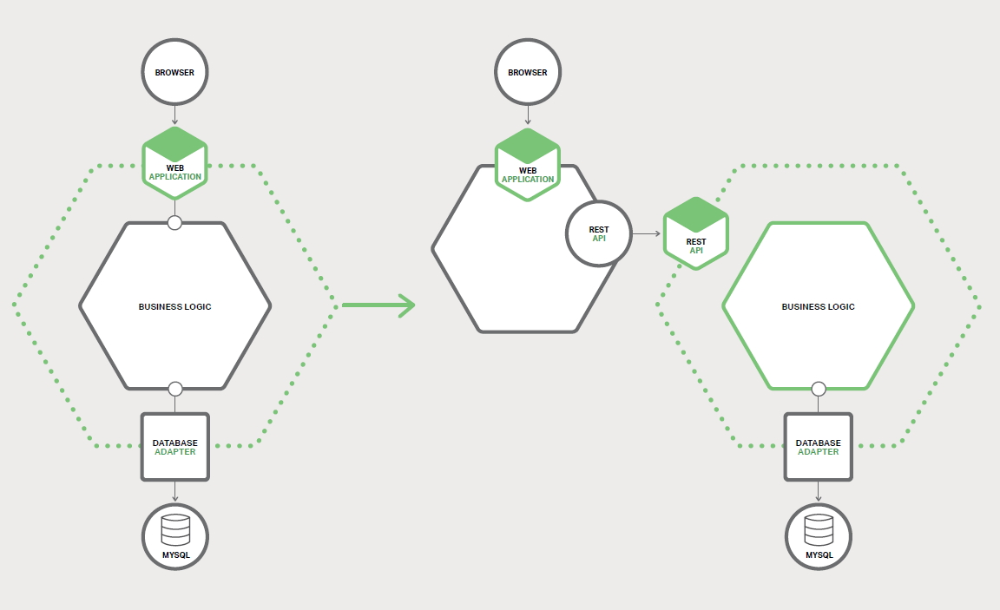

# 7、重构单体为微服务
本书是关于如何使用微服务构建应用程序，这是本书的的第七章，也是最后一章。[第一章](1-introduction-to-microservices.md)介绍了微服务架构模式，讨论了使用微服务的优点和缺点。随后的章节讨论了微服务架构的方方面面：[使用 API ​​网关](2-using-an-api-gateway.md)，[进程间通信](3-inter-process-communication.md)，[服务发现](4-service-discovery.md)，[事件驱动数据管理](5-event-driven-data-management-for-microservices.md)和[部署微服务](6-choosing-deployment-strategy.md)。在本章中，我们将介绍将单体应用程序迁移到微服务器的策略。

我希望这本电子书能够让您对微服务架构、其优点和缺点以及何时使用它有很好的了解。微服务架构也许很适合您的组织。

但是，您正在大型复杂的单体应用程序上工作，这是相当不错的机会。您开发和部署应用程序的日常经历是缓慢而痛苦的。微观服务似乎是一个遥远的天堂。幸运的是，有一些战略可以用来逃离单体地狱。在本文中，我将描述如何将单体应用程序逐渐重构为一组微服务。

## 7.1、微服务重构概述
单体应用程序转换为微服务的过程是[应用程序现代化](https://en.wikipedia.org/wiki/Software_modernization)的一种形式。这是几十年来开发人员一直在做的事情。因此，在将应用程序重构为微服务时，有一些想法可以重用。

一个不使用的策略是“大爆炸”重写。就是当您将所有的开发工作都集中在从头开始构建新的基于微服务器的应用程序时。虽然听起来很吸引人，但非常危险，有可能会失败。[据 AsMartin Fowler 说](http://www.randyshoup.com/evolutionary-architecture)：“大爆炸重写的唯一保证就是大爆炸！”（"the only thing a Big Bang rewrite guarantees is a Big Bang!"）。

您应该逐步重构单体应用程序，而不是大爆炸重写。您逐渐添加新功能，并以微服务的形式创建现有功能的扩展 —— 以互补的形式修改单体应用程序，并且一起运行微服务和修改的单体。随着时间推移，单体应用程序实现的功能量会缩小，直到它完全消失或变成另一个微服务。这种策略类似于在 70公里/小时的高速公路上驾驶一辆汽车，很具有挑战性，但比尝试大爆炸改写的风险要小得多。

Martin Fowler 将这种应用现代化策略称为[杀手应用](http://www.martinfowler.com/bliki/StranglerApplication.html)（Strangler Application）。这个名字来自于热带雨林中发现的葡萄树（也称为绞杀榕）。一棵葡萄树生长在一棵树上，以获取达到森林冠层之上的阳光。有时候，树死了，留下一个树形的腾。应用现代化遵循相同的模式。我们将构建一个新的应用程序，包括了围绕遗留应用的微服务（它将会慢慢缩小或者最终消亡）。

让我们来看看能做到这点的不同策略。

## 7.2、策略一：停止挖掘
孔的定律说，每当你身处在一个洞穴中，你应该停止挖掘。当您的单体应用变得难以管理时，这是一个很好的建议。换句话说，你应该停止，避免使单体变得更大。这意味着当您要实现新功能时，您不应该向单体添加更多的代码。相反，这一策略的主要思想是将新代码放在独立的微服务中。

应用此方法后，系统架构如图 7-1 所示。

除了新服务和传统的单体，还有另外两个组件。第一个是请求路由，它处理传入的（HTTP）请求，类似于[第二章](2-using-an-api-gateway.md)中描述的 API 网关。路由向新服务发送与新功能相对应的请求。它将遗留请求路由到单体。

另一个组件是粘合代码，它将服务与单体集成。一个服务很少孤立存在，通常需要访问单体的数据。位于单体、服务或两者中的胶合代码负责数据集成。该服务使用粘合代码来读取和写入单体的数据。

服务可以使用三种策略来访问单体数据：

- 调用由单体提供的远程 API
- 直接访问单体数据库
- 维护自己的数据副本，与单体数据库同步

胶水代码有时被称为防护层（anti-corruption layer）。这是因为粘合代码阻止了服务被遗留的单体领域模型的概念所污染，这些服务具有自己的原始领域模型。粘合代码在两种不同的模型之间转换。防护层一词首先出现于埃里克·埃文斯（Eric Evans）的必读书《领域驱动设计》（Domain Driven Design）中，并在白皮书中进行了改进。开发一个防护层是一件不简单的事情。但是，如果你想要从单体地狱中走出来，那么这是必不可少的。

使用轻量级服务来实现新功能有几个好处。它防止单体变得更加难以管理。该服务可以独立于单体开发、部署和扩展。可让你您创建的每个新服务体验到微服务体系结构的优势。

然而，这种方法没有解决单体问题。要解决这些问题，您需要分解单体。让我们来看看这样做的策略。

***待续……***

