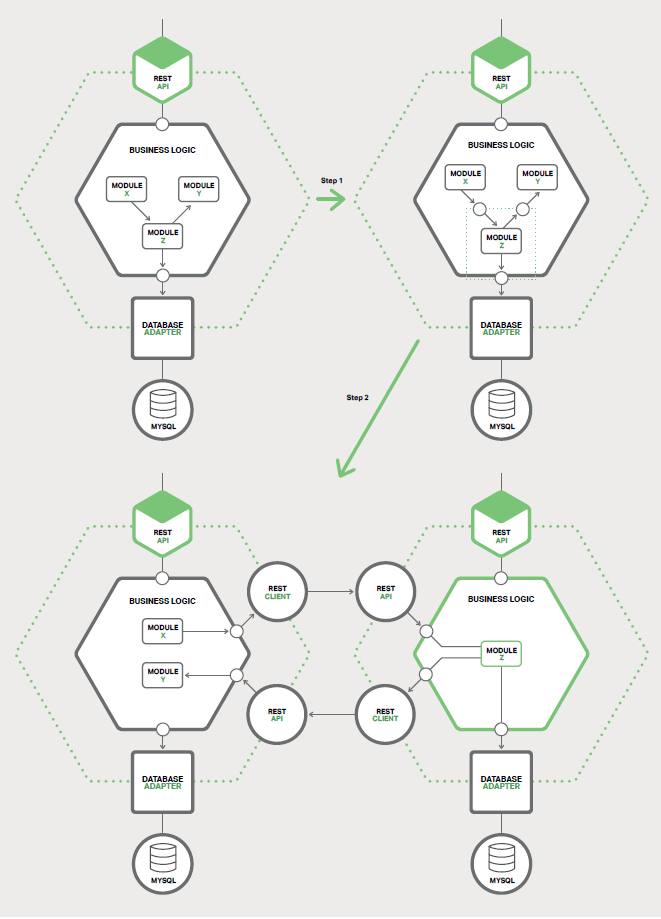

# 7、重构单体为微服务
本书是关于如何使用微服务构建应用程序，这是本书的第七章，也是最后一章。[第一章](1-introduction-to-microservices.md)介绍了微服务架构模式，讨论了使用微服务的优点与缺点。随后的章节讨论了微服务架构的方方面面：[使用 API ​​网关](2-using-an-api-gateway.md)、[进程间通信](3-inter-process-communication.md)、[服务发现](4-service-discovery.md)、[事件驱动数据管理](5-event-driven-data-management-for-microservices.md)和[部署微服务](6-choosing-deployment-strategy.md)。在本章中，我们将介绍单体应用迁移到微服务器的策略。

我希望这本电子书能够让您对微服务架构、其优点和缺点以及何时使用它有很好的了解。微服务架构也许很适合您的组织。

然而，您正工作于大型复杂的单体应用程序上，这是相当不错的机会。您开发和部署应用程序的日常经历是缓慢而痛苦的。微服务似乎是一个遥不可及的天堂。幸运的是，有一些战略可以用来逃离单体地狱。在本文中，我将描述如何将单体应用程序逐渐重构为一组微服务。

## 7.1、微服务重构概述
单体应用程序转换为微服务的过程是[应用程序现代化](https://en.wikipedia.org/wiki/Software_modernization)的一种形式。这是几十年来开发人员一直在做的事情。因此，在将应用程序重构为微服务时，有一些想法是可以重用的。

一个不要使用的策略是“大爆炸”重写。就是您将所有的开发工作都集中在从头开始构建新的基于微服务器的应用程序。虽然这听起来很吸引人，但非常危险，有可能会失败。[据 AsMartin Fowler 讲到](http://www.randyshoup.com/evolutionary-architecture)：“大爆炸重写的唯一保证就是大爆炸！”（"the only thing a Big Bang rewrite guarantees is a Big Bang!"）。

您应该逐步重构单体应用程序，而不是通过大爆炸重写。您逐渐添加新功能，并以微服务的形式创建现有功能的扩展 —— 以互补的形式修改单体应用，并且一同运行微服务和修改的单体。随着时间推移，单体应用程序实现的功能量会缩小，直到它完全消失或变成另一个微服务。这种策略类似于在 70公里/小时的高速公路上驾驶一辆汽车，这很具有挑战性，但比尝试大爆炸改写的风险要小得多。

Martin Fowler 将这种应用现代化策略称为[杀手应用](http://www.martinfowler.com/bliki/StranglerApplication.html)（Strangler Application）。这个名字来自于热带雨林中发现的葡萄树（也称为绞杀榕）。一棵葡萄树生长在一棵树上，以获取森林冠层之上的阳光。有时，树死了，留下一个树形的腾。应用现代化也遵循相同的模式。我们将构建一个新的应用程序，包括了围绕遗留应用的微服务（它将会慢慢缩小或者最终消亡）。

让我们来看看能做到这点的不同策略。

## 7.2、策略一：停止挖掘
[洞穴定律](https://en.wikipedia.org/wiki/Law_of_holes)说到，每当您身处在一个洞穴中，您应该停止挖掘。当您的单体应用变得难以管理时，这是一个很好的建议。换句话说，您应该停止扩张，避免使单体变得更大。这意味着当您要实现新功能时，您不应该向单体添加更多的代码。相反，这一策略的主要思想是将新代码放在独立的微服务中。

应用此方法后，系统架构如图 7-1 所示。

除了新服务和传统的单体，还有另外两个组件。第一个是请求路由，它处理传入的（HTTP）请求，类似于[第二章](2-using-an-api-gateway.md)中描述的 API 网关。路由向新服务发送与新功能相对应的请求。它将遗留的请求路由到单体。

另一个组件是粘合代码，它将服务与单体集成。一个服务很少孤立存在，通常需要访问单体的数据。位于单体、服务或两者中的胶合代码负责数据集成。该服务使用粘合代码来读取和写入单体数据。

服务可以使用三种策略来访问单体数据：

- 调用由单体提供的远程 API
- 直接访问单体数据库
- 维护自己的数据副本，与单体数据库同步

粘合代码有时被称为防护层（anti-corruption layer）。这是因为粘合代码阻止了服务被遗留的单体领域模型的概念所污染，这些服务具有自己的原始领域模型。粘合代码在两种不同的模型之间转换。防护层一词首先出现于埃里克·埃文斯（Eric Evans）的必读图书[《领域驱动设计》](http://www.amazon.com/Domain-Driven-Design-Tackling-Complexity-Software/dp/0321125215/ref=sr_1_1?ie=UTF8&s=books&qid=1238687848&sr=8-1)（Domain Driven Design）中，并在[白皮书](http://docs.scala-lang.org/overviews/core/futures.html)中进行了改进。开发一个防护层并不是一件简单的事。但是，如果您想要从单体地狱中走出来，这是必不可少的步骤。

使用轻量级服务来实现新功能有几个好处。它防止单体变得更加难以管理。该服务可以独立于单体开发、部署和扩展。可让您创建的每个新服务体验到微服务架构的优势。

然而，这种方法没有解决单体问题。要解决这些问题，您需要分解单体。让我们来看看这样做的策略。

## 7.3、策略二：前后端分离
缩小单体应用的一个策略是从业务逻辑层和数据访问层拆分出表现层。一个典型的企业应用由至少三种不同类型的组件组成：

- **表现层（Presentation Layer，PL）** - 处理 HTTP 请求并实现（REST）API 或基于 HTML 的 Web UI 组件。在具有复杂用户界面的应用中，表现层通常存在大量代码。
- **业务逻辑层（Business Logic Layer，BLL）** - 作为应用程序核心，实现业务规则的组件。
- **数据访问层（Data Access Layer，DAL）** - 访问基础架构组件的组件，如数据库和消息代理。

一方面的表现逻辑和另一方的业务和数据访问逻辑之间通常有一个完全的隔离。业务层具有由一个或多个门面组成的粗粒度 API，其封装了业务逻辑组件。这个 API 是一个天然的边界，您可以沿着该边界将单体拆分成两个较小的应用程序。一个应用程序包含表现层。另一个应用程序包含业务和数据访问逻辑。分割后，表现逻辑应用程序对业务逻辑应用程序进行远程调用。

重构之前和之后的架构如图 7-2 所示。

以这种方式拆分单体有两个主要优点。它使您能够独立于彼此开发、部署和扩展这两个应用。特别是，它允许表现层开发人员在用户界面上快速迭代，并且可以轻松执行 A/B 测试。这种方法的另一个优点是它暴露了可以被您开发的微服务调用的远程 API。

然而，这一策略只是一个局部解决方案。两个应用程序中的一个或两个很可能是一个无法管理的单体。您需要使用第三种策略来消除剩余的整体或单体。

## 7.4、策略三：提取服务
第三个重构策略是将庞大的现有模块转变为独立的微服务。每次提取一个模块并将其转换成服务时，单体就会缩小。一旦您转换了足够的模块，单体将不再是一个问题。或者它完全消失，或者变得足够小，它就可以被当做一个服务看待。

### 7.4.1、优先将哪些模块转换为微服务
一个庞大而复杂的单体应用由几十个或几百个模块组成，所有模块都是提取的候选项。弄清楚要先转换哪些模块往往存在一定的挑战。一个好的方法是从容易提取的几个模块开始。您将得到微服务的相关经验，特别是在提取过程方面。之后，您应该提取那些能给您最大利益的模块。

将模块转换为服务通常是耗时的。您想按照您将获得的利益对模块进行排列。提取频繁更改的模块通常是有益的。一旦将模块转换为服务，您就可以独立于单体开发和部署，这将加快开发工作。

提取这些资源需求与单体的其他模块有显著不同的模块也是有益的。例如，将有一个有内存数据库的模块转换为服务是很有用的，这样可以部署在具有大量内存的主机上，无论是裸机服务器、虚拟机还是云实例。同样，提取实现了计算昂贵算法的模块也是值得的，因为该服务可以部署在具有大量 CPU 的主机上。通过将具有特定资源需求的模块转换为服务，您可以使应用程序更加容易、廉价地扩展。

当找到要提取的模块时，寻找现有的粗粒度边界（又称为接缝）是有用的。它们使模块转成服务变得更容易和更连廉价。有关这种边界的一个例子是一个仅通过异步消息与应用程序的其他部分进行通信的模块。将该模块转变为微服务相对比较廉价和简单。   

## 7.4.2、如何提取模块
提取模块的第一步是在模块和单体之间定义一个粗粒度的接口。因为单体需要服务拥有的数据，它很可能是一个双向 API，反之亦然。由于模块和应用程序的其余之间存在着复杂的依赖关系和细粒度的交互模式，因此实现这样的 API 通常存在挑战。由于领域模型类之间的众多关联，使用[领域模型模式](http://martinfowler.com/eaaCatalog/domainModel.html)来实现的业务逻辑尤其具有挑战性。您通常需要进行重大的代码更改才能打破这些依赖。图 7-3 展示了重构。

一旦实现了粗粒度的接口，您就可以将模块变成独立的服务。要做到这点，您必须编写代码以使单体和服务通过使用进程间通信（IPC）机制的 API 进行通信。图 7-3 显示了重构前、重构中和重构后的架构。

在此例中，模块 Z 是要提取的候选模块。其组件由模块 X 使用，并且它使用了模块 Y。第一个重构步骤是定义一对粗粒度的 API。第一个接口是一个使用模块 X 来调用模块 Z 的入站接口。第二个接口是一个使用模块 Z 调用模块 Y 的出站接口。

第二个重构步骤是将模块转换为一个独立服务。入站和出站接口使用 IPC 机制的代码来实现。您将很可能需要通过将 Module Z 与 [Microservice Chassis](http://microservices.io/patterns/microservice-chassis.html) 框架相结合来构建服务，该框架负责处理诸如服务发现之类的横切点。

一旦您提取了一个模块，您就可以独立于单体和任何其他服务开发、部署和扩展其他服务。您甚至可以从头开始重写服务；在这种情况下，整合服务与单体的 API 代码成为在两个领域模型之间转换的防护层。每次提取服务时，您都会朝微服务方向迈近一步。随着时间的推移，单体将缩小，您将拥有越来越多的微服务。

## 7.5、总结
将现有应用程序迁移到微服务的过程是应用程序现代化的一种形式。您不应该从头开始重写您的应用来迁移到微服务。相反，您应该将应用程序逐渐重构为一组微服务。可以使用这三种策略：将新功能实现为微服务；从业务组件和数据访问组件中分离出表现组件；将单体中的现有模块转换为服务。随着时间推移，微服务的数量将会增长，您的开发团队的灵活性和速度也同样会增加。

## 微服务实战：用 NGINX 驯服单体

by Floyd Smith

如本章所述，将单体转换为微服务可能是一个缓慢而具有挑战性的过程，但这同样具有许多好处。使用 NGINX，您可以在实际开始转换过程之前获得微服务器的一些优势。

您可以通过将 NGINX 放在您现有的单体应用之前，以节省迁移微服务所花费的大量时间。以下简要说明与微服务有关的好处：

- **更好地支持微服务** — 如第五章最后栏目所述，NGINX 和 [NGINX Plus](https://www.nginx.com/products/) 具有利于开发基于微服务的应用的功能。当您开始重新设计单体应用时，由于 NGINX 的功能，您的微服务将执行得更好、更易于管理。
- **跨环境的功能抽象** — 从您管理的服务器到各种公共云、私有云和混合云上将功能迁移到 NGINX 作为反向代理服务器可以减少部署在新的环境中的设施数量变化。这补充扩展了微服务所固有的灵活性。
- **NGINX 微服务参考架构可用性** — 当您迁移到 NGINX 时，您可以借鉴 [NGINX 微服务参考架构](https://www.nginx.com/blog/introducing-the-nginx-microservices-reference-architecture/)（MRA，Microservices Reference Architecture），以便在迁移到微服务之后定义应用程序的最终结构，并根据需要使用的 MRA 部分应用于您创建的每个新的微服务。

总而言之，实现NGINX作为您的转型的第一步，将压倒您的单片应用程序，使其更容易获得微服务的所有优势，并为您提供用于进行转换的模型。您可以了解有关 MRA 的更多信息，并获得 NGINX Plus 的免费试用版。